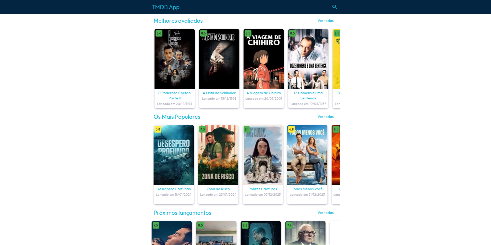

# tmdb_app

This is a "clone" of [TMDB](https://www.themoviedb.org/) made with [Flutter](https://flutter.dev/).

Access web version [here](https://dapper-cobbler-f76ebe.netlify.app/).

## Quickstart

- clone this repo locally
- change the field **YOUR_API_KEY** in the file [.run/tmdb_app.run.xml](.run%2Ftmdb_app.run.xml)
- run `dart pub get` 
- run `flutter pub run build_runner build --delete-conflicting-outputs`
- run **tmdb_app** configuration in your IDE

## Before commit guide

1. Run `flutter pub run build_runner build --delete-conflicting-outputs` to generate the MobX files
2. Run `dart analyze` to check for any errors or warnings
3. Run `dart format -l 120 .` to format the code
4. Run `flutter test` to check if all tests are passing

# Tests

### Integration Tests

Integration tests are located in the `integration_test` directory. They are used to test the app's features and the interaction between the app and the API.

To run the integration tests, use the following guide:

- change the field **YOUR_API_KEY** in the file [integration_test.run.xml](.run%2Fintegration_test.run.xml)
- run **integration_tests** configuration in your IDE

### Unit Tests

Unit tests are located in the `test` directory. They are used to test the app's logic and the interaction between the app's classes.

To run the unit tests, use the following command:

```flutter test```

# Build

### Web
Run this command:

```flutter build web --release --dart-define=API_KEY=YOUR_API_KEY```


## Dependencies

| Libraries                                                   |                                                                                                Description                                                                                                 |
|-------------------------------------------------------------|:----------------------------------------------------------------------------------------------------------------------------------------------------------------------------------------------------------:|
| [mobx](https://pub.dev/packages/mobx)                       |                                           MobX is a state-management library that makes it simple to connect the reactive data of your application with the UI.                                            |
| [intl](https://pub.dev/packages/intl)                       |                 Provides internationalization and localization facilities, including message translation, plurals and genders, date/number formatting and parsing, and bidirectional text.                 |
| [dio](https://pub.dev/packages/dio)                         | A powerful HTTP networking package for Dart/Flutter, supports Global configuration, Interceptors, FormData, Request cancellation, File uploading/downloading, Timeout, Custom adapters, Transformers, etc. |
| [flutter_mobx](https://pub.dev/packages/flutter_mobx)       |                                                      Provides the Observer widget that listens to observables and automatically rebuilds on changes.                                                       |
| [flutter_modular](https://pub.dev/packages/flutter_modular) |                     Modular is not only ingenious for doing something amazing like componentizing Routes and Dependency Injections, it's amazing for being able to do all this simply!                     |

## Dev Dependencies

| Libraries                                                          |                                                                                              Description                                                                                               |
|--------------------------------------------------------------------|:------------------------------------------------------------------------------------------------------------------------------------------------------------------------------------------------------:|
| [build_runner](https://pub.dev/packages/build_runner)              |                   Provides a concrete way of generating files using Dart code. It is used by many packages to generate code, and by end-users to generate code using those packages.                   |
| [mobx_codegen](https://pub.dev/packages/mobx_codegen)              |                                          Adds support for annotating your MobX code with @observable, @computed, @action, making it super simple to use MobX.                                          |
| [analyzer](https://pub.dev/packages/analyzer)                      |                                      This package provides a library that performs static analysis of Dart code. It is useful for tool integration and embedding.                                      |
| [network_image_mock](https://pub.dev/packages/network_image_mock)  | Since you are here you probably already know that calling Image.network results in 400 response in Flutter widget tests. The reason for this is that default HTTP client in tests always return a 400. |
| [mocktail](https://pub.dev/packages/mocktail)                      |                        Mocktail focuses on providing a familiar, simple API for creating mocks in Dart (with null-safety) without the need for manual mocks or code generation.                        |
| [modular_test](https://pub.dev/packages/modular_test)              |                                                                                 Init Modules and test the integration                                                                                  |

## API Info

This app uses the **TMDB API** to fetch the data. To use the API you need to create an account and get an API key.
Click [here](https://www.themoviedb.org/settings/api) to get your API key.

API Reference: 
- [TMDB API Docs](https://developer.themoviedb.org/docs/getting-started)
- [TMDB API Reference](https://developer.themoviedb.org/reference/intro/getting-started)

# Screenshots

## Android


[APK Download]()

## iOS

## Web


[Web Version](https://dapper-cobbler-f76ebe.netlify.app/)